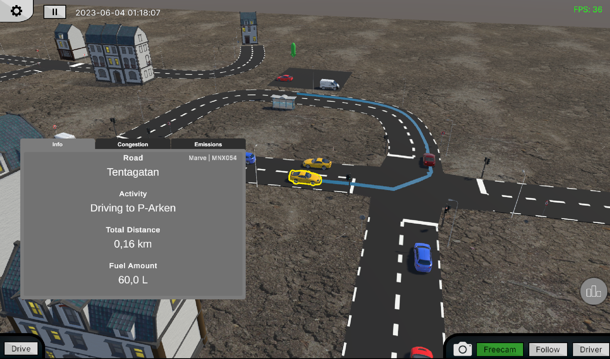
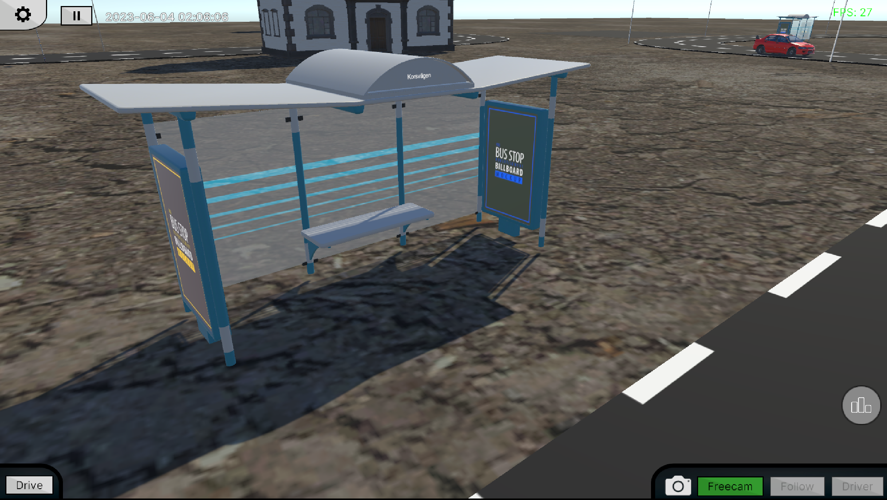

# TrafficSimulator
A bachelors thesis in Data Engineering and IT at [Chalmers University of Technology](https://www.chalmers.se/en/).
The project was a suggestion by the five members and was completed over a period of 4,5 months. For more information about the project, you are welcome to read the thesis [here](https://github.com/marc7s/Traffic-Simulator-Documentation/blob/main/Project_report/Project_report.pdf).

More documentation of the development process is available in the designated [repository](https://github.com/marc7s/Traffic-Simulator-Documentation).

# Contents of this file
1. Purpose - Here the purpose and aim of the project is explained.
2. Showcase - A demonstration of some of the features of the developed simulation tool.
3. RoadGenerator - As part of the development, a custom road system generator asset was built, based on Sebastian Lague's [Path Creator](https://github.com/SebLague/Path-Creator) tool. It was extended to include many features, such as intersection generation and vehicle navigation.
4. How to build - A short tutorial of how to build the simulation tool.

# 1. Purpose
The purpose of the project is to design and construct a 3D traffic simulation tool
with high accessibility, that should provide detailed and accessible data. This allows
the user to evaluate the performance of different road networks and traffic scenarios,
and make informed decisions about urban planning and infrastructure. Data should
be presented in real-time through presentation of relevant statistics. By adjusting
the parameters of the simulation, the user should be able to witness the effect of their
tweaking, and easily see if their changes have a positive or negative impact across
relevant environmental dimensions such as congestion level or emissions.

# 2. Showcase

## UI Overview
The User Interface, or UI for short, is the means with which the user interacts with the simulator. Therefore, effort was put into making it easy to use, following common looks and practices in order to make it intuitive. This section will showcase the different parts of the UI:
1. The main menu, where settings can be changed and from which the simulation is started.
2. The simulation UI, which is an overlay with which the user can interact during the simulation. This contains the statistics, which are presented in the following section.

### Main menu
 
*The main menu*   

 
*The scene selection menu, where you can choose the road system to simulate*   

 
*The settings menu*   

### Simulation UI
 
*An overview of the UI*   

 
*A selected vehicle, with its current navigation path and information*   

## Statistics
During the simulation, data is collected and presented in real-time to the user through the statistics panel. Here, the user can see details for specific vehicles, or statistics for the entire road network. The fuel consumption gathers the total fuel consumed by all vehicles over time, while the congestion ratio is an indication of how congested the network is. It represents the ratio of currently congested roads, and can be used to easily identify bottlenecks or heavily trafficated roads.

 
*Gathered statistics over total fuel consumption over time*   

 
*Gathered statistics over ratio of congested roads over time*   

 
*Each Road can be coloured according to the current congestion or fuel consumption*   

## Cameras
Three different cameras are available during the simulation and are presented in this section.

 
*The freecam allows the user to freely roam around*   

 
*The follow camera follows the selected vehicle*   

 
*The driver camera places the user behind the wheel of a simulated vehicle, enabling further immersion*   

## Navigation
In order for the vehicles to navigate the road system, each vehicle drives as an individual agent. The agents follow the roads - more specifically the nodes generated along the roads - which can be seen in the later section titled "RoadGenerator".

Furthermore, they need to find their way through the road system, driving through intersections and planning their route. For this, a graph is generated representing the road system. The nodes are intersections, road end points and POIs and any other point the vehicles need to find. The edges are the roads between these. Using the road system graph, an A* path finding algorithm is used by each vehicle to plan their route, which can be seen in the following gif.

 
*A generated graph representing a road system*   

 
*A vehicle navigating a RoadSystem, driving to its target*   

## Manual Driving
A user can at any time enter the manual driving mode, where they will gain control of their own vehicle. This allows the user to drive around the road system, gaining a good understanding of what it is like to drive around the road network. This facilitates a unique opportunity to evaluate changes to the system by placing yourself in the driver's seat of a road user, offering an intuitive way to understand whether it is easy for the drivers to find their way around or not.

The manual vehicle will interact with the other vehicles in the road systems, which will queue up behind the manually driven vehicle as any other vehicle. This integrates the manual car with the traffic.

 
*A car being driven manually, able to interact with the traffic*   

## OpenStreetMap - OSM
While it is possible to manually create road systems through the developed RoadGenerator tool in the Unity Editor (only available with the project open in Unity), an integration with OpenStreetMap allows for automatic generation of road systems. The integration contains a parser that can read OSM map data and generate roads, intersections, buildings, bus stops, parkings and more according to the real world data. It also configurates the roads to mirror the real world, matching settings such as road width, speed limits and one way roads.

For this project, a map of Masthugget - a district of Gothenburg, Sweden - was exported from OSM and used to generate an entire environment which can be simulated. The following section contains some images of the generated version of Masthugget.

 
*A comparison between the OpenStreetMap version and the generated environment*   

 
*An overview of the Masthugget scene*   

 
*A first person view of the generated Masthugget*   

 
*Vehicles simulated in Masthugget*   

 
*A view of Masthugget from the river Göta älv*   

## Vehicles
An important part of the simulation is the vehicles. To tie it together, a range of realistic looking models are simulated. These are showcased in this section.

 
*A number of different vehicle types are simulated for a realistic feel*   

 
*A closer look at one of the vehicles*   

## Points of Interest - POIs
A few different points of interest can be added to the road systems, such as bus stops or parkings. The simulated vehicles can interact with the POIs. As an example, they can navigate to parking POIs and park as well as leave the parking. Simulated buses can follow a specified bus route, stopping at every bus stop along the route which simulates public transport.

 
*A closeup of a generated bus stop, complete with its name tag*   

 
*A bus with its displayed navigation path, visiting all its related bus stops in order*   

 
*Vehicles parked at a roadside parking*   

 
*Vehicles parked at a parking lot*   

# 3. RoadGenerator
As part of the project, an asset called RoadGenerator was developed to allow the creation of road systems. RoadGenerator contains many different features such as automatic intersection generation and an integration with OpenStreetMap to create virtual twins of real life locations to be simulated. Some of these features will be shown in the following section, while others have already been demonstrated in the previous section. Note that there are many additional features to RoadGenerator, and that this is a simplification since it is only a showcase and not documentation.

RoadGenerator is based on Sebastian Lague's [Path Creator](https://github.com/SebLague/Path-Creator) asset, which enables the creation and editing of Bézier path. A Bézier path is a chained sequence of [Bézier curves](https://pomax.github.io/bezierinfo/), which are mathematical definitions of curves. They have many use cases and form the basis of the roads in RoadGenerator.

 
*A Bézier Path, used to describe the path of every Road*   

Nodes, called RoadNodes, are generated along the Bézier curve of every Road and are used by the navigation among others. They also contain information used by many parts of the simulation, such as the vehicles and the intersection yielding algorithms.

 
*RoadNodes generated along a Bézier path*   

 
*A mesh is generated along each Bézier curve, forming the Road*   

 
*At every intersecting point between Roads, an Intersection is automatically generated*   

There is support for two different intersection types - three and four way intersections. The type of intersection is determined automatically during the generation. Each intersection can also be configured, such as switching between traffic lights or yield signs.

 
*A four way intersection*   

 
*A three way intersection*   

The RoadGenerator asset can be used to easily manually create and edit road systems. The following is a sped up gif of a small road system being created. For larger road systems, the OSM integration is suitable as creating road networks is time consuming. This also has the benefit of replicating a real life location.

 
*A timelapse of a RoadSystem being created by hand*   

# 4. How to build
Before building, make sure you have all assets specified in `ASSETS.md` and that they are placed inside the `Unity Assets` folder, as well as all plugins specified in `PLUGINS.md` and that they are placed inside the `Plugins` folder.

1. Open the build settings through `File -> Build Settings`
2. Select the `StartMenu` scene as index 0 in the build settings, then add all the scenes for the scene selector to the list
3. Run `Build` or `Build And Run`
